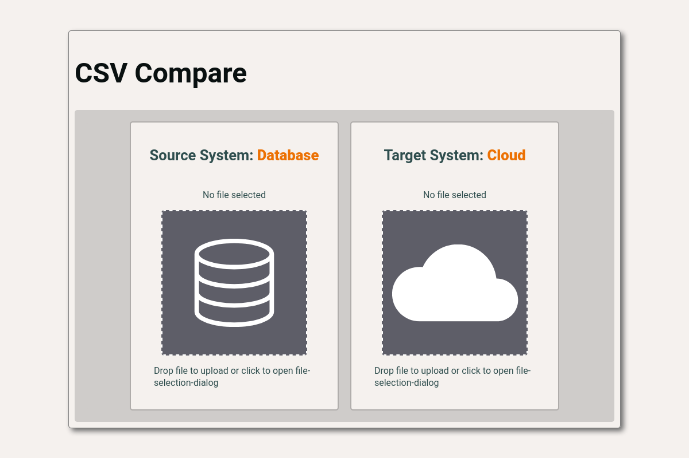
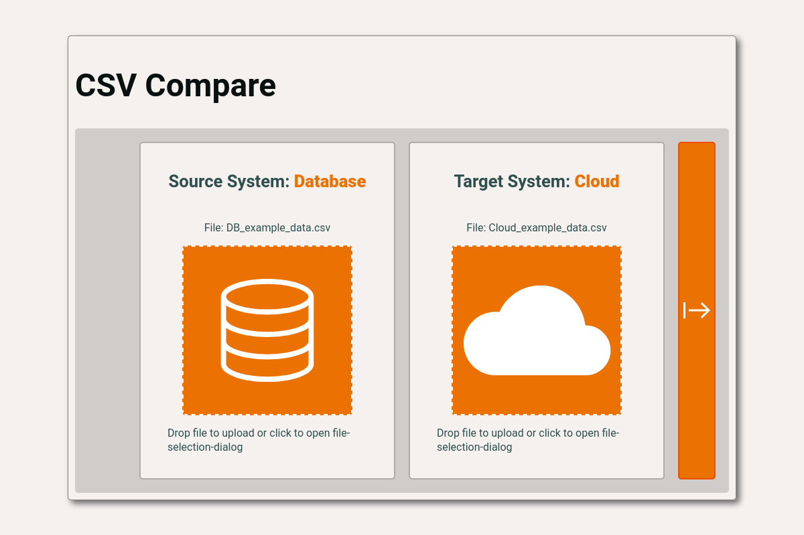
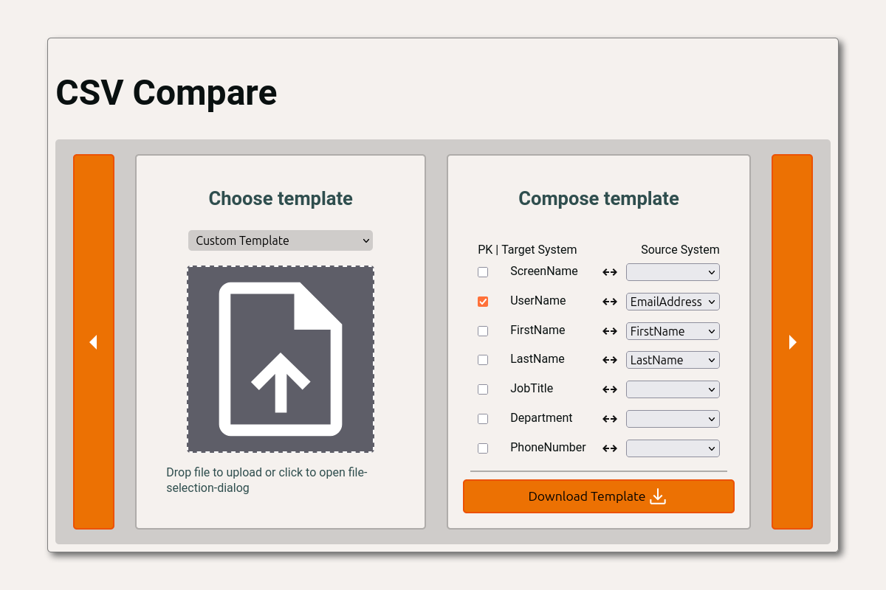
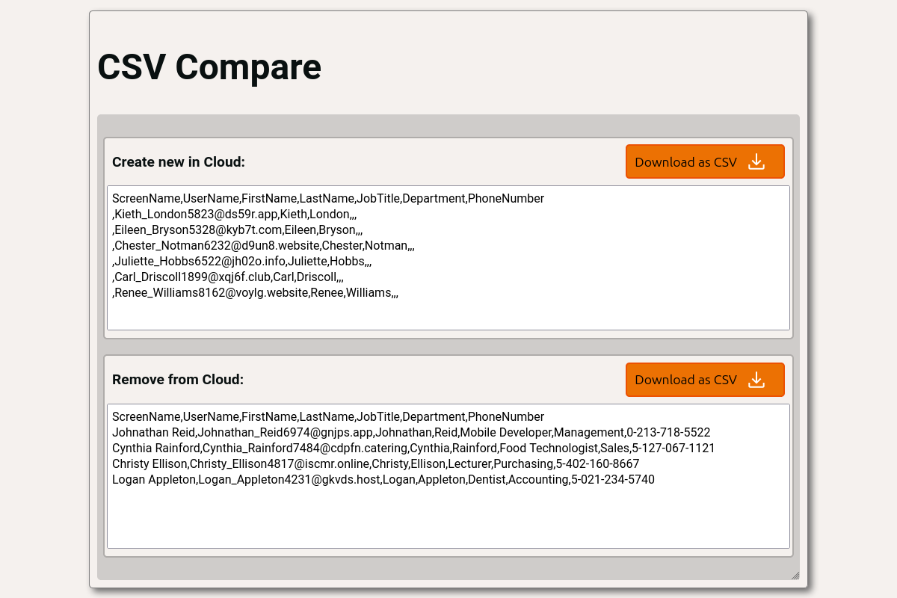

# CSV Compare


CSV Compare is a client-side web application for comparing two CSV exports from different systems.

It is designed for synchronization scenarios where one CSV file represents a **source system** and another CSV file represents a **target system**. Based on a configurable column mapping and primary key definition, the application determines which records should be inserted into the target system and which records should be removed from it.

The application runs completely in the browser. No backend service is required for the normal CSV comparison workflow.

---

## Features

- Compare two CSV files from different systems
- Upload files via drag-and-drop or file picker
- Select predefined CSV templates
- Upload custom CSV templates
- Create a template manually from detected CSV headers
- Download generated template JSON files for later reuse
- Map source columns to target columns
- Support single-column and compound primary keys
- Generate synchronization results:
    - rows to insert into the target system
    - rows to delete from the target system
- Preview generated CSV output in the browser
- Download generated result CSV files
- Configurable source and target display names/icons
- English and German localization
- Fully client-side processing
- Built with React, TypeScript, Redux Toolkit, Vite, and PapaParse
- Tested with Vitest and React Testing Library
- Linted with ESLint and formatted with Prettier

---

## How It Works

1. The user selects one CSV file from the source system and one from the target system.
2. The application reads the headers from both files.
3. The user selects, uploads, or creates a CSV template.
4. The template defines:
    - how source columns map to target columns
    - which columns form the primary key
5. The application validates the selected files and template.
6. Source data is transformed into the target CSV structure.
7. Source and target records are compared by the configured primary key.
8. Two CSV result sets are generated:
    - **insertions**: records that exist in the source data but not in the target data
    - **deletions**: records that exist in the target data but not in the source data
9. The user can preview and download both generated result files.

---

## Screenshots

### Initial screen: no files selected

When the application is opened, two upload areas are shown side by side. One area is used for the source-system CSV file, and the other is used for the target-system CSV file.



### Both files selected

After both files have been selected, the application displays the chosen file names and allows the user to continue to the next step.



### Template selection or creation

The user can select a predefined template, upload a custom template, or manually create a new template from the detected CSV headers.



### Evaluation result

After processing, the application displays generated CSV previews for insertions and deletions. Each result can be downloaded separately.



---

## CSV Input Requirements

The uploaded files must be valid CSV files.

The application expects that:

- both files contain a header row
- the source CSV contains all source columns required by the selected template
- the target CSV contains all target columns required by the selected template
- the configured primary key columns exist
- primary key values can be used to identify comparable records
- the selected template matches the structure of the uploaded files

If the files or template do not match, the application may show a validation or parsing error.

---

## Template Configuration

CSV Compare uses JSON templates to describe how the source and target CSV files relate to each other.

A template defines:

- the source-to-target column mapping
- the primary key mapping used to identify matching records

### Basic Template Structure

```json
{
    "column_match": [
        { "target": "value", "source": "value" },
        { "target": "value", "source": "value" }
    ],
    "primary_key": [{ "target": "value", "source": "value" }]
}
```

The most important aspect is that the header line from the target system determines the structure of the CSV template.

> Example:
>
> ```text
> Header from source system CSV:
>
> > UserName,LastName,FirstName,Email,PhoneNumber
> ```
>
> ```text
> Header from target system CSV:
>
> > FirstName,Surname,EmailAddress,Department
> ```
>
> Resulting CSV Template (using Surname/LastName and FirstName as a compound primary key):
>
> ```json
> {
>     "column_match": [
>         { "target": "FirstName", "source": "FirstName" },
>         { "target": "Surname", "source": "LastName" },
>         { "target": "EmailAddress", "source": "Email" },
>         { "target": "Department", "source": "" }
>     ],
>     "primary_key": [
>         { "target": "FirstName", "source": "FirstName" },
>         { "target": "Surname", "source": "LastName" }
>     ]
> }
> ```

In this example:

- `FirstName` maps directly to `FirstName`
- `LastName` from the source system maps to `Surname` in the target system
- `Email` from the source system maps to `EmailAddress` in the target system
- `Department` exists in the target structure but has no matching source column
- `Surname`/`LastName` and `FirstName` form a compound primary key

### Empty Mapping Values

A mapping entry may contain an empty `source` value (e.g., Department in the above example) to indicate that the column exists in the target system but not in the source system..

During result generation, missing mapped values are represented as empty CSV fields to fulfill the target CSV structure.

### Primary Keys

The `primary_key` section tells the application which columns identify the same logical record in both files.

A primary key can contain one or multiple column mappings. An empty 'source' value is not allowed in primary key mappings!

## Predefined Templates

Predefined templates are loaded from the public assets.

The template registry is located at:

```text
/public/templates.json
```

Each entry defines:

- `name`: the display name shown in the template selector dropdown
- `path`: the public path to the template JSON file

```json
{
    "templates": [
        { "name": "Custom Template", "path": "/templates/custom.json" }
    ]
}
```

Template files are stored in:

```text
/public/templates
```

Because these files are served as static assets, predefined templates can be changed in a deployed environment without rebuilding the TypeScript application, as long as the public files on the server are updated.

---

## Source and Target Display Configuration

The display names and icons for the compared systems are configured in:

```text
src/config/config.json
```

The default configuration for syncing a database with a cloud service looks like this:

```json
{
    "source": {
        "name": "Database",
        "icon": "/img/database.svg"
    },
    "target": {
        "name": "Cloud",
        "icon": "/img/cloud.svg"
    }
}
```

The UI uses these values to label the two compared systems.

Changing `src/config/config.json` requires rebuilding the application.

---

## Running with Docker

A `docker-compose.yaml` file is included.

Start the application with:

```bash
docker-compose up
```

The application will be available at:

```text
http://localhost:8080
```

If you changed the Docker setup, rebuild the container with:

```bash
docker-compose up --build
```

---

## Local Development

### Requirements

- Node.js
- npm

This project uses npm as its package manager.

### 1. Clone the Repository

```bash
git clone https://github.com/markus-grosshaeuser/csv-compare.git
cd csv-compare
```

### 2. Install Dependencies

```bash
npm install
```

### 3. Start the Development Server

```bash
npm run dev
```

The application will be available at the local Vite development URL shown in the terminal, usually:

```text
http://localhost:5173/
```

---

## Available Scripts

### Start Development Server

```bash
npm run dev
```

Starts the Vite development server with hot module replacement.

### Build for Production

```bash
npm run build
```

Runs the TypeScript build and creates a production build with Vite.

### Preview Production Build

```bash
npm run preview
```

Serves the production build locally for verification.

### Run Tests

```bash
npm run test
```

Runs the Vitest test suite.

### Run Linting

```bash
npm run lint
```

Runs ESLint for the project.

---

## Building and Deployment

CSV Compare is a static frontend application.

Create a production build with:

```bash
npm run build
```

The generated files are written to:

```text
dist/
```

The contents of the `dist/` directory can be deployed to any static web server, for example:

- Nginx
- Apache HTTP Server
- a static hosting provider
- an object-storage based static website
- any server capable of serving static files

No backend service is required for the normal CSV comparison workflow.

If source files are changed, rebuild the application before deploying the updated `dist/` contents.

---

## Project Structure

```
csv-compare/
  ├── public/
  │ ├── img/
  │ ├── templates/
  │ └── templates.json
  ├── screenshots/
  ├── src/
  │ ├── assets/
  │ ├── components/
  │ │ ├── DataSourceCard.tsx
  │ │ ├── FileDropArea.tsx
  │ │ ├── MultiScreenNavigationButton.tsx
  │ │ ├── ResultDisplay.tsx
  │ │ ├── TemplateCreationCard.tsx
  │ │ ├── TemplateSelectionCard.tsx
  │ │ └── TemplateSelector.tsx
  │ ├── config/
  │ │ ├── locales/
  │ │ ├── config.json
  │ │ └── i18n.ts
  │ ├── pages/
  │ │ ├── DataEvaluationScreen.tsx
  │ │ ├── DataSourceScreen.tsx
  │ │ └── DataSynchronizationScreen.tsx
  │ ├── redux/
  │ │ ├── csvHeaderSlice.ts
  │ │ ├── fileSlice.ts
  │ │ ├── store.ts
  │ │ └── templateSlice.ts
  │ ├── utilities/
  │ │ ├── CsvParser.ts
  │ │ ├── CsvUtility.ts
  │ │ ├── FileDownloadProvider.ts
  │ │ ├── InputDataValidator.ts
  │ │ ├── TemplateEstimator.ts
  │ │ └── TemplateLoader.ts
  │ ├── App.tsx
  │ └── main.tsx
  ├── test/
  │ ├── components/
  │ ├── pages/
  │ ├── redux/
  │ ├── utilities/
  │ ├── MockServer.ts
  │ ├── RenderWIthProvider.tsx
  │ └── setup.ts
  ├── docker-compose.yaml
  ├── eslint.config.js
  ├── package.json
  ├── tsconfig.json
  └── vite.config.ts
```

## Internationalization

The application uses `i18next` and `react-i18next`.

Translation files are stored in:

```text
src/config/
  ├── i18n.ts
  └── locales/
    ├── de/
    │ └── translation.json
    └── en/
      └── translation.json
```

The i18n setup is located at:

```text
src/config/i18n.ts
```

The current setup includes:

- English
- German

Browser language detection is handled by `i18next-browser-languagedetector`.

---

## Testing

The project uses:

- Vitest as the test runner
- React Testing Library for React component tests
- jest-dom matchers for DOM assertions
- jsdom as the browser-like test environment
- MSW for mocked network behavior where needed

Tests are located in the `test/` directory and cover application behavior such as:

- CSV parsing
- CSV comparison utilities
- template loading and selection
- input validation
- Redux state handling
- file download behavior
- page and component rendering
- synchronization result generation

Run all tests with:

```bash
npm run test
```

---

## Tech Stack

- React 19
- TypeScript 6
- Vite 8
- Redux Toolkit
- React Redux
- React Router
- i18next
- react-i18next
- i18next-browser-languagedetector
- PapaParse
- Axios
- Vitest
- React Testing Library
- jsdom
- MSW
- ESLint
- Prettier

---

## Browser Behavior

CSV files are parsed directly in the browser.

Generated synchronization files are created as browser-side CSV downloads. The application creates temporary object URLs for generated files and revokes them after the download has been triggered.

---

## Development Notes

- The application is fully client-side.
- CSV parsing is handled with PapaParse.
- Application state is managed with Redux Toolkit.
- Routing is handled with React Router.
- Styling uses CSS modules and shared theme styles.
- Templates can be selected, uploaded, or manually created.
- The production build can be hosted as static files.
- Normal CSV comparison does not require a server-side component.

---

## License

### MIT

Copyright 2026 Markus Großhäuser

Permission is hereby granted, free of charge, to any person obtaining a copy of this software and associated documentation files (the “Software”), to deal in the Software without restriction, including without limitation the rights to use, copy, modify, merge, publish, distribute, sublicense, and/or sell copies of the Software, and to permit persons to whom the Software is furnished to do so, subject to the following conditions:

The above copyright notice and this permission notice shall be included in all copies or substantial portions of the Software.

THE SOFTWARE IS PROVIDED “AS IS”, WITHOUT WARRANTY OF ANY KIND, EXPRESS OR IMPLIED, INCLUDING BUT NOT LIMITED TO THE WARRANTIES OF MERCHANTABILITY, FITNESS FOR A PARTICULAR PURPOSE, AND NONINFRINGEMENT. IN NO EVENT SHALL THE AUTHORS OR COPYRIGHT HOLDERS BE LIABLE FOR ANY CLAIM, DAMAGES, OR OTHER LIABILITY, WHETHER IN AN ACTION OF CONTRACT, TORT, OR OTHERWISE, ARISING FROM, OUT OF, OR IN CONNECTION WITH THE SOFTWARE OR THE USE OR OTHER DEALINGS IN THE SOFTWARE.
